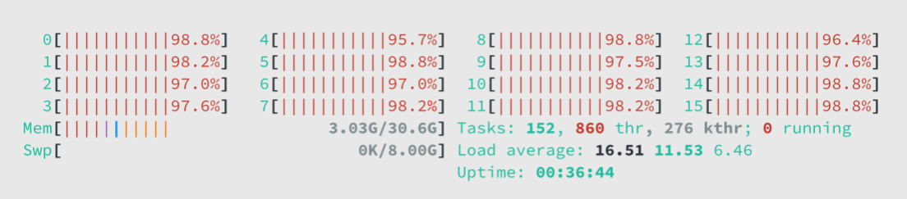

# Code Creation, The Way Nature Intended
July 24, 2025

After finishing my [last project](https://github.com/pehringer/simd) I felt a bit on edge.
The last few years of the AI hype train has made me realize that we have a narrow window of time where we can still potentially contribute to the body of human knowledge.
There will come a day in the not so distant future where humanity will no longer be in the driver's seat, but merely a kid in a booster seat.
Staring out the window of an ever accelerating car, trying to make sense of the i ncreasingly blurry shapes shooting by.
So with this omnipresent feeling in my gut, I started searching for my next project . . .

### Cellular Automata

I hopped on the hype train myself, but quickly found that I lacked both the math background and capital required to train even a small semi-cutting-edge model.
So I shifted my focus to some sort of visualization project.
The underlying matrix operations of older network architectures are simple enough to understand.
I even managed to get some pretty solid results with NumPy and Matplotlib.
But the whole idea felt a bit forced, I was working on the very thing that filled me with existential dread.


Then I rediscovered John [Conway's Game of Life](https://en.wikipedia.org/wiki/Conway's_Game_of_Life) after watching a recommended [video of the game simulating itself](https://www.youtube.com/watch?v=xP5-iIeKXE8), crazy!
The game is simple, it takes place on a grid.
Each grid cell can be either alive or dead.
The state for each cell is determined by four rules:

1) Alive cells with less than two living neighbours die.
2) Alive cells with two or three living neighbours live.
3) Alive cells with more than three living neighbours die.
4) Dead cells with three living neighbours become alive.

```
 . # . .   . . . .   . . . .   . . . .   . . . .
 . . # .   # . # .   . . # .   . # . .   . . # .
 # # # .   . # # .   # . # .   . . # #   . . . #
 . . . .   . # . .   . # # .   . # # .   . # # #

  t = 0     t = 1     t = 2     t = 3     t = 4
```

***glider pattern - traverses the grid diagonally***

With just these two states and four rules, the Game of Life is technically Turing-complete, meaning it could, in theory, compute anything given enough time and grid space!

This game falls within a broader model of computation called [Cellular Automata (CA)](https://en.wikipedia.org/wiki/Cellular_automaton), which are basically zero-player games where grid cells follow basic rules based on their immediate neighbors.
CA are awesome because they are easy to get into and offer many avenues of exploration.
So I dusted off my mechanical pencil and grid paper to start creating my very own zero-player game!

### Genetic Algorithms

I quickly discovered that building the rules for interesting behaviors was more difficult than I anticipated. I spent weeks trying different combinations of rules.
Some of my attempts were quite complicated, involving cells with four or more possible states.
It was fun and frustrating at the same time.
It almost seemed random whether a set of rules was a dud or not.

Then one day it clicked, I bet a [Genetic Algorithm (GA)](https://en.wikipedia.org/wiki/Genetic_algorithm) could find an interesting set of rules.
I first learned of GAs several years ago when I read about how [NASA used one to find an optimal antenna design](https://en.wikipedia.org/wiki/Evolved_antenna) for one of their space probes.
GAs are a class of optimization algorithms that closely mimic natural selection.
They start out with a population of random solutions.
Each solution is evaluated for how well it solves the problem at hand.
The best solutions are chosen as parents, much like in nature.
These parents combine their solutions to create new offspring solutions.
Small mutations are then applied to the offspring.
This evaluation, selection, reproduction, and mutation cycle repeats over and over, gradually evolving a population of solutions that are increasingly adept at solving the problem.

### Evolving Project



***htop command - project thread and memory usage***

So I started creating a GA that could evolve CAs.
But then I got to thinking, rules are basically just instructions right?
If I'm already evolving instructions, why limit the scope to just CAs?
What if I evolved small programs instead? This is when my project took off. 

This launched me into four months of researching, developing, and testing a general purpose problem solving program.
I am pretty happy with the results.
Below is the README as of the posting of this write up.
It's short and sweet, describing what it is, and how to use it.

While **I'm not an expert in the field of [Linear Genetic Programming (LGP)](https://en.wikipedia.org/wiki/Linear_genetic_programming)** the README also documents what I think are the novel approaches I took in the project (maybe they're not novel and I'm just illiterate).

# [github.com/pehringer/finches](https://github.com/pehringer/finches) / README.md
