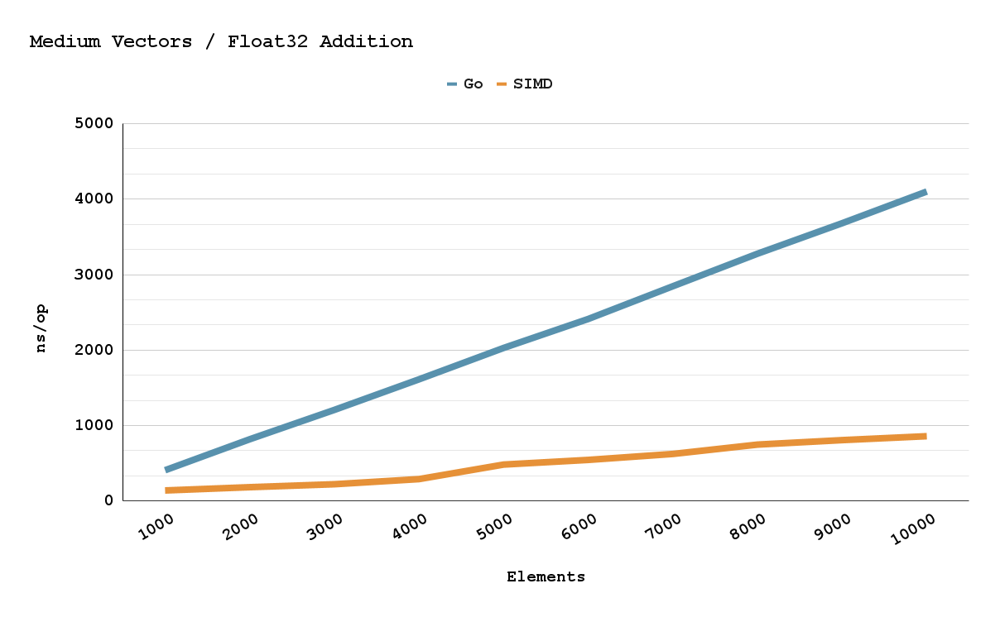

# Go, Plan9, Simd, 450% Speed Up 
  
[github.com/pehringer/simd](https://github.com/pehringer/simd)
  
I want to take advantage of Go's concurrency and parallelism for some of my upcoming projects, allowing for some serious number crunching capabilities. But what if I wanted EVEN MORE POWER?!? Enter SIMD, **S**ame **I**nstruction **M**uliple **D**ata ["sim"-"dee"]. Simd instructions allow for parallel number crunching capabilities right down at the hardware level. Many programming languages either have compiler optimizations that use simd or libraries that offer simd support. However, (as far as I can tell) Go's compiler does not utilizes simd, and I cound not find a general propose simd package that I liked. ***I just want a package that offers a thin abstraction layer over arithmetic and bitwise simd operations***. So like any good programmer I decided to slightly reinvent the wheel and write my very own simd package. How hard could it be?

After doing some preliminary research I discovered that Go uses its own internal assembly language called Plan9. I consider it more of an assembly format than its own language. Plan9 uses target platforms instructions and registers with slight modifications to their names and usage. This means that x86 Plan9 is different then say arm Plan9. Overall, pretty weird stuff. I am not sure why the Go team went down this route. Maybe it simplifies the compiler by having this bespoke assembly format? 
# Plan9 Crash Course
I always find learning by example to be the most informative.
So lets Go (haha) over a simple example.
```
example
 ┣━ AddInts_amd64.s
 ┗━ main.go
```
**example/AddInts_amd64.s**
```
1  // +build amd64
2
3  TEXT ·AddInts(SB), 4, $0
4      MOVL    left+0(FP), AX
5      MOVL    right+8(FP), BX
6      ADDL    BX, AX
7      MOVL    AX, int+16(FP)
8      RET
```
**LINE 1**: The file contains ```amd64``` specific instructions, so we need to include a Go build tag to make sure Go does not try to compile this file for non x86 machines.

**LINE 3**: You can think of this line as the functions declaration. ```TEXT``` declares that this is a function or text section. ```·AddInts(SB)``` specifies our functions name. ```4``` represents "NOSPLIT" which we need for some reason. And ```$0``` is the size of the function's stack frame (used for local variables). It's zero in this case because we can easily fit everything into the registers.

**LINE 4 & 5**: Go's calling convention is to put the function arguments onto the stack. So we ```MOV```e both ```L```ong 32-bit values into the ```AX``` and ```BX``` registers by dereferencing the frame pointer (```FP```) with the appropriate offsets. The first argument is stored at offset ```0```. The second argument is stored at offset ```8``` (int’s only need 4 bytes but I think Go offsets all arguments by 8 to maintain memory alignment).

**LINE 6**: ```Add``` the ```L```ong 32-bit value in ```AX``` (left) with the ```L```ong 32-bit value in ```BX```. And store the resulting ```L```ong 32-bit value in ```AX```.

**LINE 7 & 8**: Go's calling convention (as far as I can tell) is to put the function return values after its arguments on the stack. So we ```MOV```e the ```L```ong 32-bit values in the ```AX``` register onto the stack by dereferencing the frame pointer (```FP```) with the appropriate offset. Which is 16 in this case.
  
**example/main.go**
```
1  package main
2
3  import "fmt"
4
5  func AddInts(left, right) int
6
7  func main() {
8      fmt.Println("1 + 2 = ", AddInts(1, 2))
9  }
```

**LINE 5**: This is the forward functions declaration for our Plan9 function. Since they both share the same name (```AddInts```) Go will link them together during compilation.

**LINE 8**: We can now use our Plan9 function just like any other function.

# My Design Plan.... 9
Now that we are Go assembly experts, let's get into the details of how I structured the package. ***My main goal for the package was to offer a thin abstraction layer over arithmetic and bitwise simd operations***. Basically, I wanted a set of functions that would allow me to perform simd operations on slices.

Here's a look at a simplified example of my project structure.
```
example
 ┣━ internal
 ┃   ┗━ addition
 ┃       ┣━ AddInts_amd64.s
 ┃       ┗━ addition_amd64.go
 ┣━ init_amd64.go
 ┗━ example.go
```
First, we will create a private function pointer with a corresponding public function that wraps around it. By default we will point the private pointer to a software implementation of the function.
  
**example/example.go**: 
```
 1  package example
 2
 3  func fallbackAddInts(left, right) int {
 4     return left + right
 5  }
 6
 7  var addInts func(left, right) int = fallbackAddInts
 8
 9  func AddInts(left, right) int {
10      return addInts(left, right)  
11  }
```
Next, we create an internal package that contains an architecture specific Plan9 implementation of our function.
  
**example/internal/addition/AddInts_amd64.s**
```
1  // +build amd64
2
3  TEXT ·AddInts(SB), 4, $0
4      MOVL    left+0(FP), AX
5      MOVL    right+8(FP), BX
6      ADDL    BX, AX
7      MOVL    AX, int+16(FP)
8      RET
```
**example/internal/addition/addition_amd64.go**
```
1  // +build amd64
2
3  package addition
4 
5  func AddInts(left, right) int
```
Lastly, we will create an init function to configure the private function pointer with our internal packages corresponding Plan9 function.
  
**example/init_amd64.go**
```
1  // +build amd64
2
3  package example
4
5  import "example/internal/addition"
6 
7  addInts = addition.AddInts
```
**TLDR** The use of a private function pointer combined with architecture specific init functions and packages (using Go build tags) allows our example package to support multiple architectures easily!

# Some Juicy Simd
Now will all the gunk loaded into your mind I will let you decipher some of my x86 simd plan9 functions.

**[simd/internal/sse/Supported_amd64.s](https://github.com/pehringer/simd/blob/main/internal/sse/Supported_amd64.s)**
```
 1  // +build amd64
 2
 3  // func Supported() bool
 4  TEXT ·Supported(SB), 4, $0
 5    //Check SSE supported.
 6    MOVQ    $1, AX
 7    CPUID
 8    TESTQ   $(1<<25), DX
 9    JZ      sseFalse
10    //sseTrue:
11    MOVB    $1, bool+0(FP)
12    RET
13  sseFalse:
14    MOVB    $0, bool+0(FP)
15    RET
```
**[simd/internal/sse/AddFloat32_amd64.s]()**
```
 1  // +build amd64
 2
 3  // func AddFloat32(left, right, result []float32) int
 4  TEXT ·AddFloat32(SB), 4, $0
 5      //Load slices lengths.
 6      MOVQ    leftLen+8(FP), AX
 7      MOVQ    rightLen+32(FP), BX
 8      MOVQ    resultLen+56(FP), CX
 9      //Get minimum length.
10      CMPQ    AX, CX
11      CMOVQLT AX, CX
12      CMPQ    BX, CX
13      CMOVQLT BX, CX
14      //Load slices data pointers.
15      MOVQ    leftData+0(FP), SI
16      MOVQ    rightData+24(FP), DX
17      MOVQ    resultData+48(FP), DI
18      //Initialize loop index.
19      MOVQ    $0, AX
20  multipleDataLoop:
21      MOVQ    CX, BX
22      SUBQ    AX, BX
23      CMPQ    BX, $4
24      JL      singleDataLoop
25      //Add four float32 values.
26      MOVUPS  (SI)(AX*4), X0
27      MOVUPS  (DX)(AX*4), X1
28      ADDPS   X1, X0
29      MOVUPS  X0, (DI)(AX*4)
30      ADDQ    $4, AX
31      JMP     multipleDataLoop
32  singleDataLoop:
33      CMPQ    AX, CX
34      JGE     returnLength
35      //Add one float32 value.
36      MOVSS   (SI)(AX*4), X0
37      MOVSS   (DX)(AX*4), X1
38      ADDSS   X1, X0
39      MOVSS   X0, (DI)(AX*4)
40      INCQ    AX
41      JMP     singleDataLoop
42  returnLength:
43      MOVQ    CX, int+72(FP)
44      RET
```
# Performace And The Future
I promise all this gunk is worth it! I made a few charts so you can see the performance difference between a Go software implementation and a Plan9 simd implementation. Currently, my package only supports 64-bit x86 machines. If there is enough interest, I will throw in some 64-bit ARM support as well!
  
**Simd Repo:** [github.com/pehringer/simd](https://github.com/pehringer/simd)
  
**Simd Docs:** [pkg.go.dev/github.com/pehringer/simd](https://pkg.go.dev/github.com/pehringer/simd)
  


  